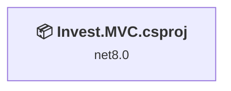
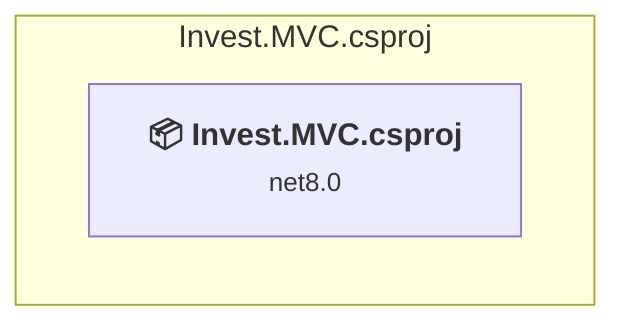

# Projects and dependencies analysis

This document provides a comprehensive overview of the projects and their dependencies in the context of upgrading to .NETCoreApp,Version=v10.0.

## Table of Contents

- [Executive Summary](#executive-Summary)
  - [Highlevel Metrics](#highlevel-metrics)
  - [Projects Compatibility](#projects-compatibility)
  - [Package Compatibility](#package-compatibility)
  - [API Compatibility](#api-compatibility)
  - [Binding Redirect Configuration](#binding-redirect-configuration)
- [Aggregate NuGet packages details](#aggregate-nuget-packages-details)
- [Top API Migration Challenges](#top-api-migration-challenges)
  - [Technologies and Features](#technologies-and-features)
  - [Most Frequent API Issues](#most-frequent-api-issues)
- [Projects Relationship Graph](#projects-relationship-graph)
- [Project Details](#project-details)

  - [Invest.MVC.csproj](#investmvccsproj)

## Executive Summary

### Highlevel Metrics

| Metric | Count | Status |
| :--- | :---: | :--- |
| Total Projects | 1 | All require upgrade |
| Total NuGet Packages | 9 | 6 need upgrade |
| Total Code Files | 77 |  |
| Total Code Files with Incidents | 3 |  |
| Total Lines of Code | 7848 |  |
| Total Number of Issues | 14 |  |
| Estimated LOC to modify | 7+ | at least 0,1% of codebase |

### Projects Compatibility

| Project | Target Framework | Difficulty | Package Issues | API Issues | Binding Issues | Est. LOC Impact | Description |
| :--- | :---: | :---: | :---: | :---: | :---: | :---: | :--- |
| [Invest.MVC.csproj](#investmvccsproj) | net8.0 | 🟢 Low | 6 | 7 | 0 | 7+ | AspNetCore, Sdk Style = True |

### Package Compatibility

| Status | Count | Percentage |
| :--- | :---: | :---: |
| ✅ Compatible | 3 | 33,3% |
| ⚠️ Incompatible | 1 | 11,1% |
| 🔄 Upgrade Recommended | 5 | 55,6% |
| ***Total NuGet Packages*** | ***9*** | ***100%*** |

### API Compatibility

| Category | Count | Impact |
| :--- | :---: | :--- |
| 🔴 Binary Incompatible | 0 | High - Require code changes |
| 🟡 Source Incompatible | 3 | Medium - Needs re-compilation and potential conflicting API error fixing |
| 🔵 Behavioral change | 4 | Low - Behavioral changes that may require testing at runtime |
| ✅ Compatible | 20397 |  |
| ***Total APIs Analyzed*** | ***20404*** |  |

## Aggregate NuGet packages details

| Package | Current Version | Suggested Version | Projects | Description |
| :--- | :---: | :---: | :--- | :--- |
| Highsoft.Highcharts | 11.4.6.5 |  | [Invest.MVC.csproj](#investmvccsproj) | ✅Compatible |
| Microsoft.EntityFrameworkCore.Design | 8.0.29 | 10.0.10 | [Invest.MVC.csproj](#investmvccsproj) | La mise à niveau du package NuGet est recommandée |
| Microsoft.EntityFrameworkCore.Sqlite | 8.0.28 | 10.0.10 | [Invest.MVC.csproj](#investmvccsproj) | La mise à niveau du package NuGet est recommandée |
| Microsoft.EntityFrameworkCore.Tools | 8.0.28 | 10.0.10 | [Invest.MVC.csproj](#investmvccsproj) | La mise à niveau du package NuGet est recommandée |
| Microsoft.VisualStudio.Azure.Containers.Tools.Targets | 1.23.0 |  | [Invest.MVC.csproj](#investmvccsproj) | ⚠️Le package NuGet est incompatible |
| Microsoft.VisualStudio.Web.CodeGeneration.Design | 8.0.23 | 10.0.2 | [Invest.MVC.csproj](#investmvccsproj) | La mise à niveau du package NuGet est recommandée |
| NuGet.Packaging | 6.14.3 |  | [Invest.MVC.csproj](#investmvccsproj) | ✅Compatible |
| NuGet.Protocol | 6.14.3 |  | [Invest.MVC.csproj](#investmvccsproj) | ✅Compatible |
| System.Text.Json | 8.0.6 | 10.0.10 | [Invest.MVC.csproj](#investmvccsproj) | La mise à niveau du package NuGet est recommandée |

## Top API Migration Challenges

### Technologies and Features

| Technology | Issues | Percentage | Migration Path |
| :--- | :---: | :---: | :--- |

### Most Frequent API Issues

| API | Count | Percentage | Category |
| :--- | :---: | :---: | :--- |
| M:System.TimeSpan.FromMinutes(System.Double) | 2 | 28,6% | Source Incompatible |
| T:System.Text.Json.JsonDocument | 2 | 28,6% | Behavioral Change |
| M:Microsoft.AspNetCore.Builder.ExceptionHandlerExtensions.UseExceptionHandler(Microsoft.AspNetCore.Builder.IApplicationBuilder,System.String) | 1 | 14,3% | Behavioral Change |
| M:System.TimeSpan.FromSeconds(System.Double) | 1 | 14,3% | Source Incompatible |
| T:System.Net.Http.HttpContent | 1 | 14,3% | Behavioral Change |

## Projects Relationship Graph

Legend:
📦 SDK-style project
⚙️ Classic project

## Project Details

### Invest.MVC.csproj

#### Project Info

- **Current Target Framework:** net8.0
- **Proposed Target Framework:** net10.0
- **SDK-style**: True
- **Project Kind:** AspNetCore
- **Dependencies**: 0
- **Dependants**: 0
- **Number of Files**: 88
- **Number of Files with Incidents**: 3
- **Lines of Code**: 7848
- **Estimated LOC to modify**: 7+ (at least 0,1% of the project)

#### Dependency Graph

Legend:
📦 SDK-style project
⚙️ Classic project

### API Compatibility

| Category | Count | Impact |
| :--- | :---: | :--- |
| 🔴 Binary Incompatible | 0 | High - Require code changes |
| 🟡 Source Incompatible | 3 | Medium - Needs re-compilation and potential conflicting API error fixing |
| 🔵 Behavioral change | 4 | Low - Behavioral changes that may require testing at runtime |
| ✅ Compatible | 20397 |  |
| ***Total APIs Analyzed*** | ***20404*** |  |

